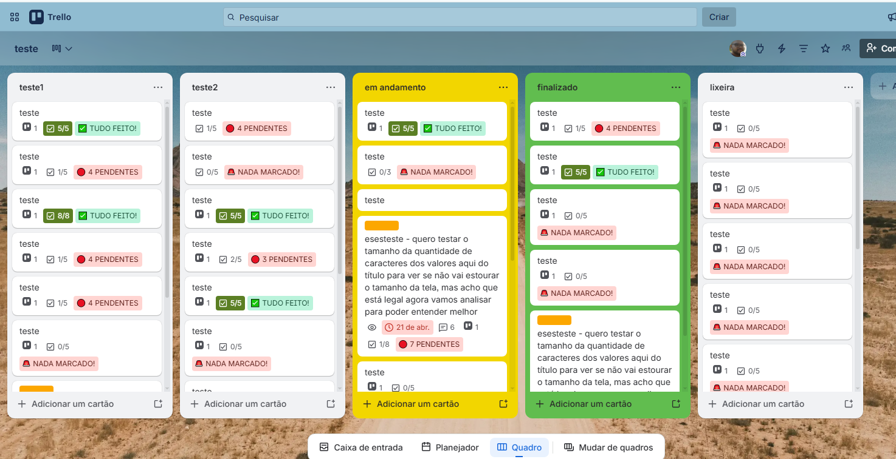

# Checklist Progress Badge — Trello Power-Up

Power-Up para o Trello que exibe **badges de progresso de checklists** diretamente nos cartões do quadro, sem precisar abrir cada cartão para saber o status.



---

## Como funciona

O Power-Up lê os dados de checklist de cada cartão e exibe um badge colorido indicando o estado de conclusão:

| Badge | Cor | Condição |
|---|---|---|
| `✅ TUDO FEITO!` | 🟢 Verde | Todos os itens marcados |
| `⚠️ X PENDENTE(S)` | 🟡 Amarelo | ≥ 50% concluído, ainda há pendências |
| `🔴 X PENDENTE(S)` | 🔴 Vermelho | < 50% concluído |
| `🚨 NADA MARCADO!` | 🔴 Vermelho | Nenhum item marcado |

> Cartões sem checklist não exibem badge.

---

## Badge disponível

### No quadro (card-badges)
Exibe um badge resumido por cartão com a quantidade de itens pendentes e a porcentagem geral de conclusão.

---

## Instalação

1. Acesse o [Trello Power-Up Admin](https://trello.com/power-ups/admin) e crie um novo Power-Up.
2. Preencha a **Connector URL** com a URL onde o `index.html` está hospedado (ex: GitHub Pages).
3. Ative a capability: `card-badges`.
4. No seu quadro do Trello, vá em **Power-Ups** e ative o **Checklist Progress Badge**.

---

## Hospedagem com GitHub Pages

1. Faça o fork ou clone deste repositório.
2. Ative o **GitHub Pages** nas configurações do repositório (branch `main`, pasta raiz).
3. Use a URL gerada (ex: `https://seu-usuario.github.io/trello-checklist-powerup/`) como Connector URL no admin do Trello.

---

## Estrutura do projeto

```
trello-checklist-powerup/
├── index.html       # Lógica principal do Power-Up
├── icon.svg         # Ícone do Power-Up
├── images/
│   └── exemplo_funcionamento.png
└── README.md
```

---

## Licença

MIT
